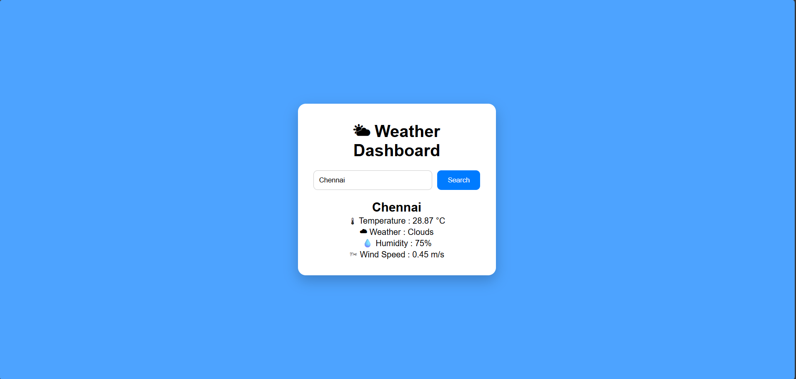

# 🌦 Weather Dashboard

A responsive weather dashboard built using HTML, CSS, JavaScript, and the OpenWeather API.

## Features

- Search weather by city
- Live weather information
- Displays:
  - Temperature
  - Weather condition
  - Humidity
  - Wind Speed
- Responsive user interface

## Technologies Used

- HTML5
- CSS3
- JavaScript
- OpenWeather API

## Live Demo

https://joseblesse6.github.io/weather-dashboard/

## Screenshots

## Future Improvements

- Current location weather
- 5-day weather forecast
- Dark mode
- Weather icons
- Better animations

## Author

Joselin Margrate Blesse
